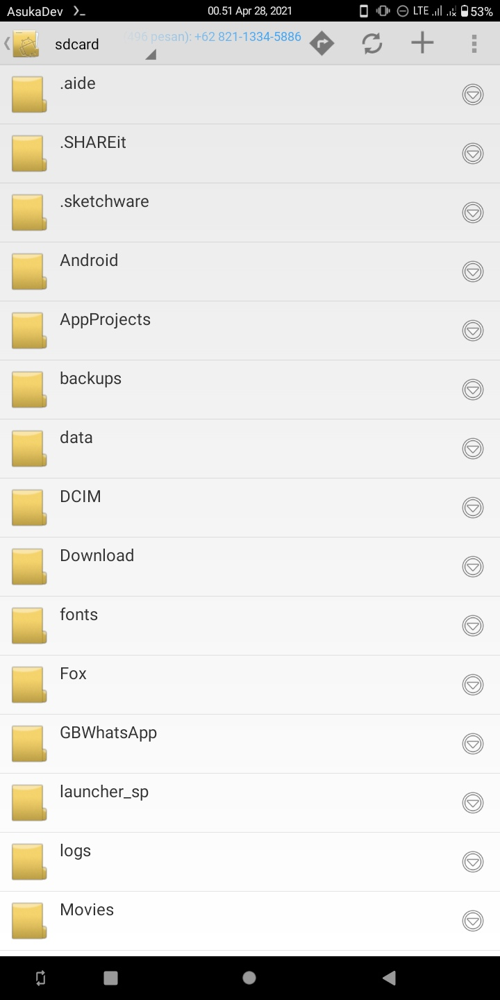

  

# Info

 

<a href="https://github.com/AsukaDev-Official/Anime-Tracker/stargazers/">

##
### :octocat: Hi, thanks for spending your time visiting this repository !

This is Source Code Android App File Explorer

